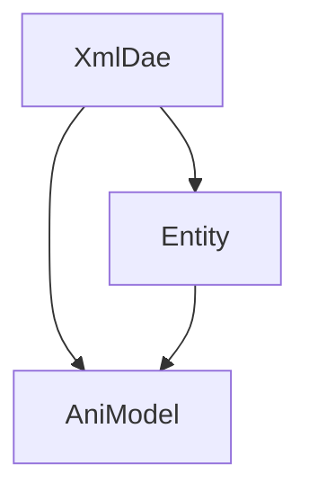

# Animate 클래스 사용법
### XmlDae 
  - RawModel3d 가져오기
```c#
xmlDae = new XmlDae(EngineLoop.PROJECT_PATH + "\\Res\\guybrush.dae");
```
  - Action 가져오기 (Action 파일의 생성법은 아래 참고)
```c#
xmlDae.AddAction(EngineLoop.PROJECT_PATH + "\\Res\\Action\\Jump.dae")
```


### Entity

### AniModel


# Mixamo 사용법
### 캐릭터 가져오기
* 블렌더 -> Export (Fbx) -> PathMode(Copy) -> Embed Textures
 

* Mixamo -> Upload Character -> 동그라미로 Rig 설정

### Weight 적용하기
* 자동으로 Bone에 따른 Weight를 적용함.
   
### 캐릭터 내보내기
* 캐릭터만 FBX Binary, T-pose로 보내기
* 블렌더에서 fbx파일 Import하기
* 오브젝트와 Armature를 선택하여 DAE Export하기 (옵션:


### Action 내보내기


