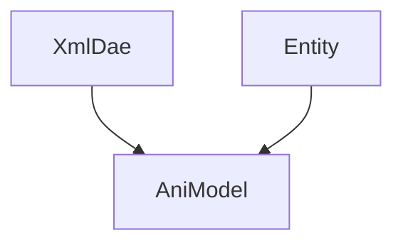

# Animate 클래스 사용법
### XmlDae 
  - RawModel3d 가져오기
```c#
xmlDae = new XmlDae(EngineLoop.PROJECT_PATH + "\\Res\\guybrush.dae");
```
  - Action 가져오기 (Action 파일의 생성법은 아래 참고)
```c#
xmlDae.AddAction(EngineLoop.PROJECT_PATH + "\\Res\\Action\\Jump.dae")
```


### Entity

### AniModel


### Mixamo 사용법
1. 캐릭터 가져오기
2. Weight 적용하기
3. Action 추가하기
